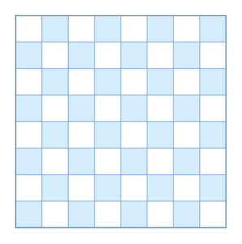

## Теория
1. Где хранится объект?
2. Когда удаляется объект?
3. Когда удаляется метод из стека?
4. Где хранятся примитивные переменные метода? примитивные переменные объекта
5. Что работает быстрее куча или стек?
6. Как передается примитив в метод? как передается ссылочный тип в метод
7. Почему в массиве нельзя изменить размер после создания?
8. Как можно увеличить размер массива, если хочется?
9. Что такое двумерный/трехмерный массив?
10. Что является номером строки, а что номером столбца в записи вида `a[8][4]`
## Практика
### Уровень 1
1. Создайте метод, который принимает примитив и прибавляет к нему число 5 (подумайте как можно получить результат сложения)
2. Объявить двумерный массив, заполнить целыми числами и показать на экран. 
3. Найти максимальный элемент побочной диагонали (cлайд 14 поможет)
4. Создать двумерный массив. Заполнить его элементами, каждый из которых вычисляется по формуле: `a[i,j] =7*i-3*j`. Вывести массив на экран. 
5. С помощью двумерных массивов напечатайте на консоль следующую фигуру (массив 8 на 8) - подсказка подумайте над четностью номера колонки и строки
- белый цвет 0 (можно сделать пробел)
- черный цвет 1 (можно сделать `x`)
- 
6. Вывести на консоль количество отрицательных элементов под главной диагональю матрицы 
7. Задан двухмерный массив чисел. Элементы матрицы вводятся с клавиатуры. Найти среди четных элементов матрицы максимальный элемент. Вывести результат.
### Уровень 2
1) Реализуйте алгоритм сортировки пузырьком. Алгоритм состоит в повторяющихся проходах по сортируемому массиву. На каждой итерации последовательно сравниваются соседние элементы, и, если порядок в паре неверный, то элементы меняют местами.

[пример работы](https://ru.wikipedia.org/wiki/%D0%A1%D0%BE%D1%80%D1%82%D0%B8%D1%80%D0%BE%D0%B2%D0%BA%D0%B0_%D0%BF%D1%83%D0%B7%D1%8B%D1%80%D1%8C%D0%BA%D0%BE%D0%BC#/media/%D0%A4%D0%B0%D0%B9%D0%BB:Bubble-sort-example-300px.gif)

2) Создать 2 двумерных массива 5x5 и заполнить их числами, написать программу для нахождения суммы двух массивов
3) Это сложная задачка, если есть идеи и хочется поломать мозг, можно сделать.
Подумайте как можно реализовать игру морской бой и если есть идеи можете накидать примерную реализацию (должна быть двухмерный массив)